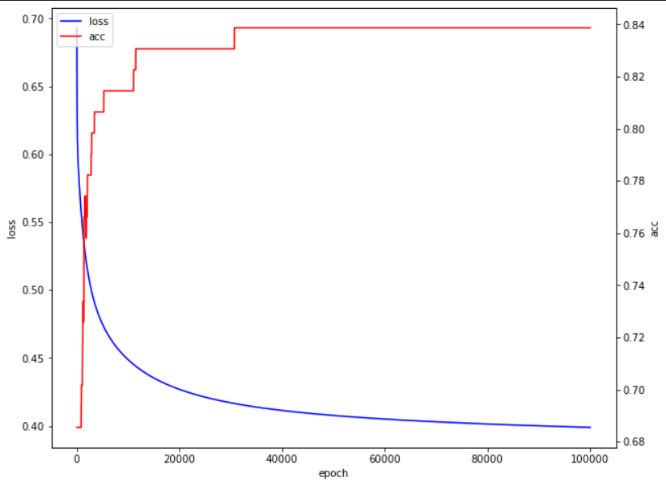

# 实验报告

### 数据处理

1. 处理缺失值

    - 使用平均值填充数值类型，众数填充非数值类型。填充操作可以使用 `df.fillna()` 完成。

2. 处理非数值类型

    - 使用 `pd.get_dummies` 即可。但注意到对于只有两种取值的类型，使用one-hot编码是多余的，删除其中任意一列即可。

3. 正规化数据

    - 将数据归一化非常重要，应该让所有数据的取值范围在0到1之间。否则，在梯度下降的时候，不同维度的差别实际上非常大，导致出现极大范围的波动甚至最终不收敛。
    - 另外，观察数据的分布，通常假设其服从正态分布，但在本例中看到明显的长尾，可以使用根号的方式缓解。

4. 采样

    - 可以使用 `df.sample(frac=1)` 对数据shuffle，之后按行号划分即可。注意最好按照正负例分层抽样，否则可能造成正负比例不均，容易出现测试例上损失较低，测试准确率却较差的情况。

### 模型训练

使用普通的梯度下降法。其中，损失函数和梯度直接使用书上提供的即可。L1/L2正则化项及其梯度与具体任务无关，直接根据目前参数计算。

每一轮训练时，直接将当前参数减去学习率乘以损失函数梯度，当两轮loss差距小于设定阈值或达到指定轮数时退出。

### 模型测试

- 一次典型的训练loss曲线及准确率曲线如下图：
    

- 不同参数的比较：
    
    - 首先指出学习率参数的特点。当该参数设置的较大时，模型会来回震荡而不收敛。但当参数较小时，其小幅度的改动对模型的影响并不明显，只会一定程度上影响收敛速度。框架默认提供的0.1是足够好的经验值。
    - 正则化系数设置过大也会造成模型不收敛。但设置的较小时，观察到L1/L2/无正则项的区别不大。推测这是由于模型系数本身已经足够小，无需额外防止过拟合。

- 准确率结果：
    在添加数据正则化、使用分层采样之后，在多次测试中准确率虽然仍有波动，已经均在80%以上，且较好时会有85%以上，一般在83%左右。