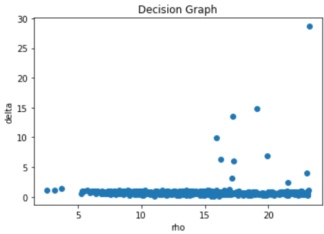
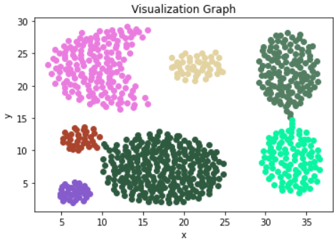
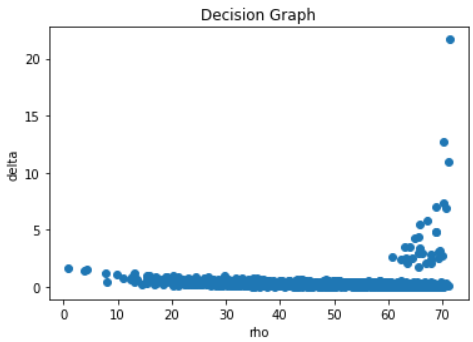
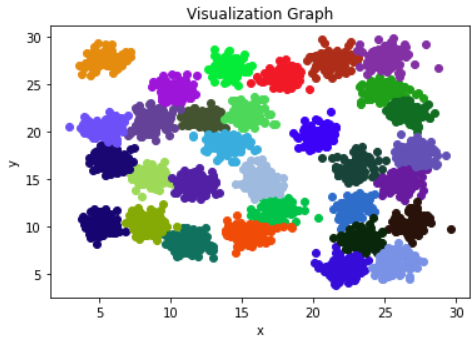
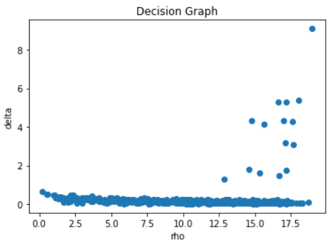
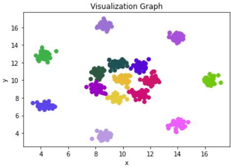

# 机器学习 实验三

> PB21000039 陈骆鑫

## 实验内容

实现论文 [*"Clustering by fast search and find of density peaks"*](https://sites.psu.edu/mcnl/files/2017/03/9-2dhti48.pdf) 中描述的聚类算法。

## 实验原理

Density Peaks Clustering (DPC) 是一个完全根据两点距离数据的聚类算法，并且可以无需迭代一次计算出聚类结果。该算法基于以下两个假设：
- 聚类中心点的密度大于边缘点的密度；
- 聚类中心点通常离密度更大的点更远。

基于这样的思想，算法的具体步骤如下：

1. 计算局部密度 $\rho_i = \sum_{j \ne i} [d_{ij} < d_c]$，其中 $d_c$ 是预先选定的超参数；
2. 计算到密度更大的点的最近距离 $\delta_i = \min_{\rho_j > \rho_i} d_{ij}$。对密度最大的点，令 $\delta_i = \max_j d_{ij}$；
3. 根据 $\rho$ 和 $\delta$ 数据，即可完成对数据的聚类。具体地，不同类型的点有如下的特征：
- $\rho$ 和 $\delta$ 都较大的点是聚类中心；
- $\rho$ 较小，而 $\delta$ 较大的点是离群数据；
- $\delta$ 较小的数据是非中心点。

## 代码实现

### 计算 $\rho$ 与 $\delta$ 数据

根据读入的坐标计算出距离矩阵，之后的计算只依赖于该距离矩阵。下面的代码根据恒等式 $|x - y|^2 = x^T x + y^T y - 2x^T y$ 计算距离。

```python
def calc_dist_matrix(X: np.ndarray) -> np.ndarray:
    prod = X @ X.transpose()
    self_prod = np.diagonal(prod, axis1=0, axis2=1)
    return np.sqrt(-2 * prod + self_prod + self_prod[:, np.newaxis])
```

$\rho$ 的计算需要提供一个参数 $d_c$，作者建议使每个点的平均邻居个数为总点数的 $1-2\%$，因此这里选取所有两点距离的 $2\%$ 分位数。

```python
# Using 1-2% quantile as d_c
def calc_dc(D: np.ndarray, rate=0.02):
    allD = D[np.triu_indices(m, 1)]
    return np.quantile(allD, rate), np.max(allD), np.min(allD)
```

则 $\rho_i$ 的值即为其 $d_c$ 邻域内点的个数。除了截断函数的和外，还可以使用更平滑的高斯函数的和 $\sum_{j} \exp{ - ( \dfrac{d_{ij}}{d_c}} )^2$ 反应局部密度。

```python
def calc_rho(D: np.ndarray, dc: np.float64, method="gaussian") -> np.ndarray:
    if method == "gaussian":
        return np.sum(np.exp(-((D / dc) ** 2)), axis=-1) - 1
    else:
        return np.sum(D < dc, axis=-1) - 1  # exclude self
```

计算 $\delta_i$，选择出局部密度更大的位置，计算出对这些位置距离的最小值即可（在这里保存取到最小值的点的坐标，供之后确定每个点所属的类使用）。特殊处理密度最大的点，即不存在密度更大的位置的情况。

```python
def calc_delta(D: np.ndarray, rho: np.ndarray):
    delta = np.zeros(rho.shape)
    neigh = np.zeros(rho.shape, dtype=int)
    for i in range(m):
        j_list = np.where(rho > rho[i])[0]
        if len(j_list):
            delta[i] = np.min(D[i][j_list])
            neigh[i] = j_list[np.argmin(D[i][j_list])]
        else:
            delta[i] = np.max(D[i])
    return delta, neigh
```

得到 $\rho$ 和 $\delta$ 数据后，可以以它们为横纵坐标画出散点图，作者称其为决策图，可以直观地反映出每个点所属的情况。

### 确定聚类中心与所属类

$\rho$ 和 $\delta$ 都较大的点被视作聚类中心。在这里，作者没有给出明确的“都较大”的标准，可以采用计算两者乘积，取乘积最大的 $k$ 个点作为聚类的中心的方式；此时类似于 k-means 方法，$k$ 被作为算法的一个参数。当然，也可以采用以分位数为分界等方式，更加自适应地选择。

```python
def select_centers(rho: np.ndarray, delta: np.ndarray, K: int):
    return np.argsort(-rho * delta)[:K]
```

$\rho$ 较小，而 $\delta$ 较大的点被视作离群点。在本实验提供的数据中，没有发现明显满足这个特征的数据，因此不做对离群点的筛选（另外，筛出离群点后，可能会影响评估的准确性）。

对于其余的点，我们认为它与最近的密度更大点的类别相同（这就是前面保存该数据的用途）。

```python
def choose_cluster(neigh: np.ndarray, centers: np.ndarray, rho: np.ndarray):
    cluster = np.array([-1] * m)
    for c, i in enumerate(centers):
        cluster[i] = c
    for i in np.argsort(-rho):
        if cluster[i] == -1:
            cluster[i] = cluster[neigh[i]]
    return cluster
```

得到每个点的分类标签后，结合一开始读取的坐标数据，即可画出聚类的可视化图像。


## 结果分析

在本实现中，$k$ 被作为一个可调节的参数。因此，我们可以结合决策图、可视化情况、评估指标等动态调节每个数据集的 $k$ 值，得到最好的聚类结果。三个数据集上的结果分别如下：

### Aggregation.txt

决策图：



可视化：



DBI 指标为 0.5036。

### D31.txt

决策图：



可视化：



DBI 指标为 0.5519。

### R15.txt

决策图：



可视化：



DBI 指标为 0.3148。

可以看到，在调整参数之后，算法可以给出与直观相一致的结果。