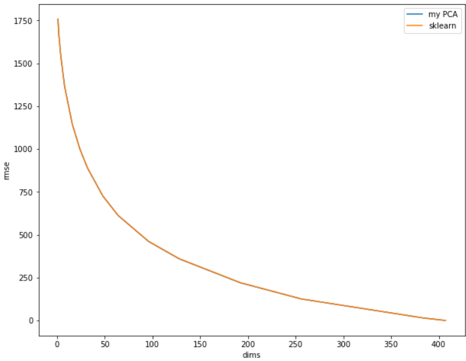
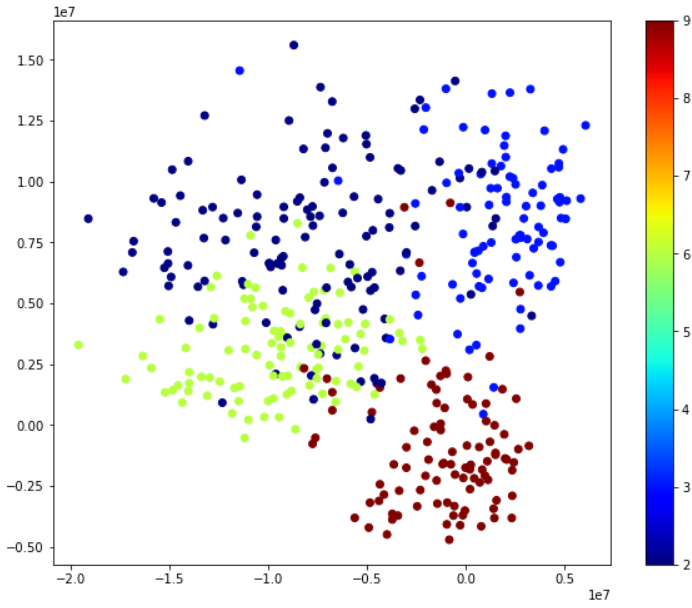

# 机器学习 实验四报告

> PB21000039 陈骆鑫

### 实验内容

实现主成分分析（PCA）以及多维缩放（MDS）两种降维方法。

### 实验原理

#### PCA 算法

PCA 算法是找到一组低维正交基，只使用在其上的投影表示样本点的一种降维方法。也就是对于 $\pmb X = (\pmb x_1, \pmb x_2, \cdots, \pmb x_m)$，找到一组正交基 $\pmb W = (\pmb w_1, \pmb w_2, \cdots, \pmb w_{d'}) $（$\pmb W^T \pmb W = \pmb I_{d'}$），使用 $\pmb Z = \pmb W^T \pmb X$ 作为低维坐标。

PCA 算法能够从最近重构性和最大可分性两种性质独立推导出来。由于之后我们要分析并比较重构误差，这里从最近重构性推导。

最近重构性指使用投影表示使用低维坐标重构这些点，与原始样本点之间的距离要尽可能近。容易推导出重构坐标 $\hat{\pmb x_i} = \pmb W \pmb z_i$，则需要最小化：

$$
\begin {aligned}
\sum\limits_{i = 1}^m \| \hat{\pmb x_i} - \pmb x_i \|^2 = \sum\limits_{i = 1}^m \| \pmb W \pmb W^T \pmb x_i - \pmb x_i \|^2 = \sum\limits_{i = 1}^m (\pmb x_i^T \pmb x_i - 2 \pmb x_i^T \pmb W \pmb W^T \pmb x_i)
\end{aligned}
$$

则只需最大化 $\sum\limits_{i = 1}^m \pmb x_i^T \pmb W \pmb W^T \pmb x_i = {\rm tr}(\pmb W^T \pmb X \pmb X^T \pmb W)$，限制条件 $\pmb X \pmb X^T = \pmb I_{d'}$。

根据拉格朗日乘子法，这个问题的解应该满足 $\pmb X \pmb X^T \pmb W = \pmb \Lambda \pmb W$。只要求出 $X X^T$ 的特征值并从大到小排序，较大的 $d'$ 个特征值对应的特征向量就是要求的标准正交基。

### MDS 算法

MDS 算法直接得到样本在低维空间中的表示 $\pmb Z$。该算法的目标是希望任意两个样本在 $d'$ 维空间内的欧氏距离等于原始空间中的欧氏距离，即 $\| \pmb z_i  - \pmb z_j\| = \| \pmb x_i - \pmb x_j\| := d_{ij}$。

令降维后的内积矩阵为 $\pmb B = \pmb Z^T \pmb Z$，则它满足 $d_{ij}^2 = (\pmb z_i - \pmb z_j)^T (\pmb z_i - \pmb z_j) = b_{ii} + b_{jj} - 2 b_{ij}$。

由于平移不改变距离，不妨设降维后的样本被中心化，即 $\sum\limits_{i=1}^m \pmb z_i = \pmb 0$。则 $\pmb B$ 的行和和列和均为 $0$，即 $\sum\limits_{i=1}^m b_{ij} = \sum\limits_{j=1}^m b_{ij} =0$。则可以推导出：

$$
\sum\limits_{i=1}^m d_{ij}^2 = {\rm tr}(\pmb B) + m b_{jj} \\
\sum\limits_{j=1}^m d_{ij}^2 = {\rm tr}(\pmb B) + m b_{ii} \\
\sum\limits_{i=1}^m\sum\limits_{j=1}^m d_{ij}^2 = 2m \ {\rm tr}(\pmb B)
$$

结合 $d_{ij}^2 = b_{ii} + b_{jj} - 2 b_{ij}$，可以得到 $b_{ij} = \dfrac 12 (d_{i\cdot}^2 + d_{\cdot j}^2 - d_{\cdot \cdot}^2 - d_{ij}^2)$。其中 $d_{i\cdot}^2 = \dfrac1m \sum\limits_{i=1}^m d_{ij}^2$，$d_{\cdot j}^2 = \dfrac1m \sum\limits_{j=1}^m d_{ij}^2$，$d_{i\cdot}^2 = \dfrac1{m^2} \sum\limits_{i=1}^m \sum\limits_{j=1}^m d_{ij}^2$。

已知 $\pmb B$ 之后求 $\pmb Z$，只需做特征值分解 $B = \pmb V \pmb \Lambda \pmb V^T$，若 $\Lambda$ 的非零元素数量不超过 $d'$，$\pmb Z = \pmb \Lambda_{d'}^{1/2} \pmb V^T$ 即满足条件。但一般情况下这个条件不被满足，此时我们放宽条件，只要求降维后的距离与原始空间中尽可能接近（而不要求严格相等），则取最大的 $d'$ 个特征值及其对应特征向量即可。

### 代码实现

注意上面所有推导中，样本矩阵是以每一列为一个样本向量，而一般操作的矩阵是每行一个数据，因此形式上可能会相差一个转置。

#### PCA 算法

首先对样本中心化，之后直接调用 `numpy.linalg.eig` 计算 $X^T X$ 的特征值分解。通过转置将特征向量变为行向量形式。

```python
X_mean = np.average(X, axis = 0)
X = X - X_mean
vals, vecs = np.linalg.eig(X.T @ X)
vecs = vecs.T
```

若需要降维 $d$ 维，选择最大的 $d$ 个特征值和对应特征向量（`numpy` 在特征值分解时已经按照顺序排好了，故均选择前 $d$ 个即可）。则直接有 $\pmb Z = \pmb X \pmb W^T, \hat {\pmb X} = \pmb Z \pmb W$。

```python
vals, vecs = vals[:d], vecs[:d]
Z = X @ vecs.T
X_construct = Z @ vecs
```

要分析重构误差，需要采用一个评测指标，这里我使用 RMSE（均方根误差）$RMSE = \sqrt{\dfrac 1 m \sum\limits_{i=1}^m (y_i - x_i)^2}$。由于我们要比较的是向量，将差更改为欧氏距离，即 $RMSE = \sqrt{\dfrac 1 m \sum\limits_{i=1}^m \| y_i - x_i\|^2}$。计算如下：

```python
def calc_rmse(X: np.ndarray, Y: np.ndarray):
    return np.sqrt(np.mean(np.sum(np.square(X - Y), axis = 1)))
```

### MDS 算法

首先使用原始空间中的内积矩阵计算距离矩阵（的平方）：

```python
inner_prod = X @ X.T
self_prod = np.diagonal(inner_prod)
dis_square = self_prod + self_prod[:][np.newaxis] - 2 * inner_prod
```

计算行和（等于列和）和总和，根据公式得到矩阵 $B$。

```python
dis_sqsum = np.sum(dis_square, axis=0) / m
dis_all = np.sum(dis_sqsum) / m
B = (-dis_square - dis_all + dis_sqsum + dis_sqsum[:][np.newaxis] ) / 2
```

对 $B$ 特征值分解，取较大的特征值和特征向量。则 $\pmb V \pmb \Lambda^{1/2}$ 就是降维后的样本坐标矩阵。

```python
vals, vecs = np.linalg.eig(B)
vals, vecs = vals[:d], vecs[:, :d]
X_reduced = vecs @ np.diag(vals)
```

### 结果分析

### PCA

比较使用不同维度降维、重构后，手工实现的 PCA 方法和 `sklearn` 库中的方法在 RMSE 指标上的差别。作出使用的维度和 RMSE 之间的关系图如下：



可以看到两者几乎完全重合。

### MDS 算法

按照降维后的坐标，数据中的类标记画散点图。



可以看到相同类中的点明显聚在一起。但由于降维时没有用到类标记的信息，类与类之间没有很明显的区分开来。